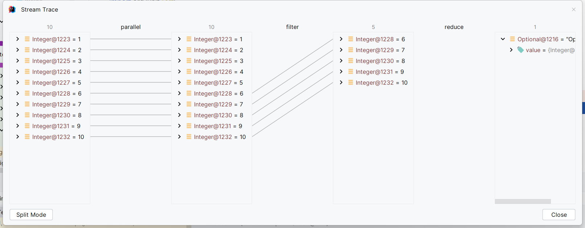

# 函数式编程-Stream流
# 1 概述

## 1.1 为什么要学？
- 能够看懂公司的代码
- 大数量下处理集合效率高
- 代码可读性高
- 消灭嵌套地狱

观察下面代码，一堆嵌套循环，看着是否很难受
```java
class Test {
    /*
    查询未成年作家评分在70分以上的数据，由于洋流影响所以
    作家的书籍可能重复，需要进行去重        
     */
    public void method() {
        List<Book> bookList = new ArrayList<Book>();
        //set具有去重的效果
        Set<Book> uniqueBookValues = new HashSet<Book>();
        Set<Author> uniqueAuthorValues = new HashSet<Author>();
        for (Author author : uniqueAuthorValues) {
            if (uniqueAuthorValues.add(author)) {
                if (author.getAge() < 18) {
                    List<Book> books = author.getBooks();
                    for (Book book : books) {
                        if (book.getSore() > 70) {
                            if (uniqueBookValues.add(book)) {
                                BookList.add(book);
                            }
                        }
                    }
                }
            }
        }
    }
}
```
那我们可以使用函数式编程进行修改
```java
class Test {
    /*
    查询未成年作家评分在70分以上的数据，由于洋流影响所以
    作家的书籍可能重复，需要进行去重        
     */
    public void method() {
        List<Book> collect = authors.stream()
                .distinct()
                .filter(author -> author.getAge() < 18)
                .map(author -> author.getBooks())
                .flatMap(Collection::stream)
                .filter(book -> book.getSore > 70)
                .distinct()
                .collect(Collection.toList());
    }
}
```

## 1.2 函数式编程思想
### 1.2.1 概念
面对对象思想需要关注用什么对象完成什么事情，而函数式编程思想
就类似于我们数学中的函数。它主要关注的是数据进行什么操作。
### 1.2.2 优点
- 代码简洁，开发快速
- 接近自然语言，易于理解
- 易于“并发编程”


# Lambda表达式
## 2.1 概述 
Lambad是JDK8的一个语法糖。它可以
对某些匿名内部类的写法进行进化。它是函数式编程的重要体现。
让我们不用关注是什么对象，而是更加关注对数据进行什么操作。

## 2.2 原则
> 可推导可省略
> 
## 2.3 基本格式
```text
(参数列表) -> {代码}
```
例一：

创建线程使用Runnable匿名类并启动
```java
class Test {
    public static void main(String[] args) {
        new Thread(new Runnable() {
            @Override
            public void run() {
                System.out.println("Running");
            }
        }, "t1").start();
    }
}
```
> 我们使用Lambda来优化它
```java
class Test {
    public static void main(String[] args) {
        new Thread(() -> {
            System.out.println("Running");
        }, "t1").start();
    }
}
```
例二：
```java
@Slf4j
public class Test0 {
    //使用Lambda传参calculateNun()方法
    @Test
    public void test1() {
        int result = calculateNun(10, 20, (x, y) ->{
            return  x * y;
        });
        System.out.println(result);
    }

    //将两个数进行运算
    public static int calculateNun(int a, int b, IntBinaryOperator operator) {
        return operator.applyAsInt(a, b);
    }
}
```
例三
```java
@Slf4j
public class Test0 {
    public static void printNum(int[] arr, IntPredicate predicate) {
        for (int num : arr) {
            if (predicate.test(num)) {
                log.debug("even: {}", num);
            }
        }
    }

    @Test
    public void test2() {
        int[] arr = {1, 2, 3, 4, 5, 6, 7, 8, 9, 10};
        printNum(arr, x -> {  //是否是偶数
            return x % 2 == 0;
        });
    }
}
```
例四

```java
@Slf4j
public class Test0 {
    //类型转化
    public static <R> R typeConvert(String num, Function<String, R> function) {
        return function.apply(num);
    }
    @Test
    public void test3() {
        Integer result = typeConvert("123", (x) -> {
            return Integer.parseInt(x);
        });
        log.debug("convertAfter: {}", result);
    }
}
```
## 2.4 省略规则
- 参数类型可以省略
- 方法体只有一句代码时，大括号return或唯一一句代码的分号
可以省略
- 方法只有一个参数时，小括号可以省略
- 以上的规则记不住也可以省略不记

```java
@Slf4j
public class Test0 {
    public static void foreachArr(List<Object> list, Consumer consumer) {
        for (Object object : list) {
            consumer.accept(object);
        }
    }

    @Test
    public void test4() {
        List<Object> list = new ArrayList<Object>();
        list.add(1);
        list.add(3);
        list.add(5);
        list.add(9);
        //方式1
        foreachArr(list, (x) -> {
            log.debug("{}", x);
        });
        //方式2，使用省略规则
        foreachArr(list, x -> log.debug("{}", x) );
    }
}
```

# 3. Stream流
## 3.1 概述
java8的Strean使用的是函数式编程，如同它的名字一样，它可以
用来对集合或数组进行链状流式的操作。可以方便让我们对集合
或数组操作。

## 3.2 案例数据准备
```java
@Data
@NoArgsConstructor//没有无参构造
@AllArgsConstructor
@EqualsAndHashCode//重写了equal和hashcode方法
public class Author {
    private Long id;
    private String name;
    private Integer age;
    private String intro;
    private List<Book> books;
}
```
```java
@Data
@NoArgsConstructor//没有无参构造
@AllArgsConstructor
@EqualsAndHashCode//重写了equal和hashcode方法
public class Book {
    private Long id;
    private String bookName;
    private String category;
    private Integer score;
    private String intro;
}
```
```java
public class InitData {
    public static List<Author> initAuthor1() {
        //创建一些作者对象
        Author a1 = new Author(1L, "梦多", 33, "一个从菜刀中明悟哲理的人", null);
        Author a2 = new Author(2L, "亚拉索", 15, "风不及我的思考速度", null);
        Author a3 = new Author(3L, "易", 14, "是世界限制了我的思考", null);
        Author a4 = new Author(3L, "易", 14, "是世界限制了我的思考", null);
        //书记列表
        List<Book> b1 = new ArrayList<Book>();
        List<Book> b2 = new ArrayList<Book>();
        List<Book> b3 = new ArrayList<Book>();
        b1.add(new Book(1L, "刀的两侧是光与暗",  "爱情，哲学", 88, "用一把刀分割爱恨"));
        b1.add(new Book(2L, "一个人不能死在同一把刀下",
                "成长，哲学", 99, "从失败中明悟哲学"));

        b2.add(new Book(3L, "那风吹不到的地方", "哲学", 85, "用思维看世界尽头"));
        b2.add(new Book(3L, "那风吹不到的地方", "哲学", 85, "用思维看世界尽头"));
        b2.add(new Book(4L, "那些白线，接与不接", "哲学", 56, "为自己的错误买单"));

        b3.add(new Book(5L, "你的剑就是我的剑", "爱情", 68, "一个武者的伴侣的宽容"));
        b3.add(new Book(6L, "风遇见", "传记", 80, "错过即是最好的相遇"));
        b3.add(new Book(6L, "风遇见", "传记", 80, "错过即是最好的相遇"));
        a1.setBooks(b1);
        a2.setBooks(b2);
        a3.setBooks(b3);
        return new ArrayList<>(Arrays.asList(a1, a2, a3));
    }
}
```
## 3.3 快速入门
### 3.3.1 需求
打印所有年龄小于18岁的作者的名字，注意去重
```java

public class Test0 {
    @Test
    public void test0() {
        List<Author> authors = InitData.initAuthor1();
        authors.stream()//把集合转化成流
                .distinct()//去重
                .filter(author -> author.getAge() < 18)
                .forEach(author -> System.out.println(author.getName()));

    }
}
```
> 可以在使用流的位置打断点，调试中找到 Throw Current Stream Chain

## 3.4 常用操作
### 3.4.1 创建流
单例集合：`集合对象.stream()`
```text
    List<Author> authors = new ArrayList<Author>();
    Stream<Author>stream = authors.stream();
```
数组：Arrays.stream(数组)或者使用Stream.of(数组)创建
```text
    Integer[] arr = {1, 2, 3, 4, 5, 6, 7, 8};
    Stream<Integer> stream0 = Arrays.stream(arr);
    Stream<Integer> stream0 = Stream.of(arr);
```
双列集合：转化成单例集合后再创建
```text
    Map<String, Integer> map = new HashMap<String, Integer>();
    map.put("那笔小新", 19);
    map.put("黑子", 17);
    map.put("湘湘", 18);
    Stream<Map.Entry<String, Integer>> stream = map.entrySet().stream();
```
### 3.4.2 中间操作
     
**filter**
可以对流中的元素进行条件过滤，符合条件的会留在流中

例如：打印姓名长度大于1的作家姓名
```java
@Slf4j
public class Test0 {
    List<Author> authors = InitData.initAuthor1();
    @Test
    public void test0() {
        //打印姓名长度大于1的作家姓名
        authors.stream()
                .filter(author -> author.getName().length() > 1)//过滤筛选
                .forEach(author -> log.debug("Author : {}", author.getName()));
    }

}
```
**map**
可以把流中元素或转化

例如：打印所有作家
```java
@Slf4j
public class Test0 {
    List<Author> authors = InitData.initAuthor1();

    @Test
    public void test1() {
        authors.stream()
                .map(Author::getName)//将流中的元素由Author--->String
                .forEach(name -> log.debug("Author : {}", name));
    }
}
```
**distinct**
可以去除流中重复的元素

例如：打印所有作家的姓名，不能有重复的
```java
@Slf4j
public class Test0 {
    List<Author> authors = InitData.initAuthor1();
    @Test
    public void test3() {
        //打印所有作家的姓名，姓名不能有重复的
        authors.stream()
                .map(Author::getName)
                .distinct()
                .forEach(name -> log.debug("name = {}", name));
        //打印作者信息，不能有重复
        authors.stream()
                .distinct()
                .forEach(System.out::println);
    }
}
```
> **注意**
> 
> distinct方法以来Object的equals方法来判断是否是相同的对象。所以需要注意重写equals方法

**sorted**
可以对流中的元素进行排序

例如：对流中元素按照年龄进行降序排序，并且要求不能有重复的元素
```java
@Slf4j
public class Test0 {
    List<Author> authors = InitData.initAuthor1();
    @Test
    public void test4() {
        //实现Comparable接口：对流中元素按照年龄进行降序排序，并且要求不能有重复的元素
        authors.stream()
                .distinct()
                .sorted()
                .forEach(System.out::println);
        //没有实现接口方法：
        authors.stream()
                .distinct()
                .sorted((o1, o2) -> o1.getAge()-o2.getAge() )
                .forEach(System.out::println);
    }
}
```
> **注意**
> 
> 空参的sorted方法需要流中元素实现了Comparable接口

**limit**
可以设置流的最大长度，超出部分会被抛弃

例如：对流中元素按照年龄进行降序排序，并且要求不能有重复的元素，然后打印其中年龄最大的两位作家的姓名
```java
@Slf4j
public class Test0 {
    List<Author> authors = InitData.initAuthor1();
    public void test5() {
        //对流中元素按照年龄进行降序排序，并且要求不能有重复的元素，然后打印其中年龄最大的两位作家的姓名
        authors.stream()
                .distinct()
                .sorted((o1, o2) -> o1.getAge() - o2.getAge())
                .limit(2)
                .forEach(System.out::println);
    }
}
```

**skip**
跳过流中前n个元素，返回剩下的

例如：
```java
@Slf4j
public class Test0 {
    List<Author> authors = InitData.initAuthor1();
   
    @Test
    public void test6() {
        //对流中元素按照年龄进行降序排序，并且要求不能有重复的元素，然后打印其中年龄最大的两位作家
        authors.stream()
                .distinct()
                .sorted((o1, o2) -> -(o1.getAge()-o2.getAge()))
                .skip(1)
                .forEach(System.out::println);
    }
}
```

**flatMap**
map只能把一个对象转化为另一个对象的元素，二flatMap可以把一个对象转化为多个对象流中的元素

例一：打印所有书籍的名字，要求去重
```java
@Slf4j
public class Test0 {
    List<Author> authors = InitData.initAuthor1();
    @Test
    public void test7() {
        authors.stream()
                .flatMap(author -> author.getBooks().stream())
                .distinct()//去重
                .forEach(book -> log.debug("{}", book));
    }
}
```

例二：打印书籍的所有分类。要求分类进行去重。不能出现这种形式：哲学、爱情
```java
@Slf4j
public class Test0 {
    List<Author> authors = InitData.initAuthor1();
   
    @Test
    public void test8() {
        authors.stream()
                .flatMap(author -> author.getBooks().stream())
                .distinct()
                //将字符数组转化为流
                .flatMap(book -> Arrays.stream(book.getCategory().split(",")))
                //去重
                .distinct()
                .forEach(category -> log.debug("{}",  category));
    }
}
```

### 3.4.3 终结操作
**forEach**
对流中的元素进行遍历，我们通过传入的参数指定对遍历元素进行什么具体操作

例如：输出所有作家姓名
```java
@Slf4j
public class Test1 {
    List<Author> authors = InitData.initAuthor1();
    @Test
    public void test0() {
        //可以直接进行遍历
        authors
                .forEach(author -> log.debug("name ：{}", author.getName()));
        System.out.println("---------------------------");
        //可以转化成流再进行遍历
        authors.stream()
                .forEach(author -> log.debug("name ：{}", author.getName()));

    }
}
```

**count**
可以获取当前流中元素个数

例子：打印作家的所有书籍，注意去重
```java
@Slf4j
public class Test1 {
    List<Author> authors = InitData.initAuthor1();
 
    @Test
    public void test1() {
        //打印作家的所有书籍，注意去重
        long count = authors.stream()
                .distinct()
                .flatMap(author -> author.getBooks().stream())
                .distinct()
                .count();
        log.debug("count = {}", count);
    }
}
```

**max&min**
获取流中的最值

例子：分别获取这些作家的书籍中分数最高和最低并打印
```java
@Slf4j
public class Test1 {
    List<Author> authors = InitData.initAuthor1();
    @Test
    public void test2() {
        //分别获取这些作家的书籍中分数最高和最低并打印
        for (Author author : authors) {
            Optional<Integer> max = author.getBooks().stream()
                    //转化为分数
                    .map(Book::getScore)
                    .max(Integer::compare);

            Optional<Integer> min = author.getBooks().stream()
                    //转化为分数
                    .map(Book::getScore)
                    .max(Integer::compare);
            log.debug("{} max {}", author.getName(), max.get());
            log.debug("{} min {}", author.getName(), min.get());
        }
    }
    @Test
    public void test3() {
        //求书籍中分数最高的
        Optional<Integer> max = authors.stream()
                .distinct()//去重
                .flatMap(author -> author.getBooks().stream())
                .distinct()//去重
                //转元素类型
                .map(Book::getScore)
                .max(Integer::compare);
        log.debug("max {}", max.get());
        //求书籍中分数最低的
        Optional<Integer> min = authors.stream()
                .distinct()//去重
                .flatMap(author -> author.getBooks().stream())
                .distinct()//去重
                //转元素类型
                .map(Book::getScore)
                .min(Integer::compare);
        log.debug("min {}", min.get());
    }
}
```

**collect**
把流转化成集合

例子：（list）分别获取这些作家的书籍中分数最高和最低并打印，注意去重
```java
@Slf4j
public class Test1 {
    List<Author> authors = InitData.initAuthor1();
  
    @Test
    public void test4() {
        //分别获取这些作家的书籍中分数最高和最低并打印，注意去重
        //1.获取作家流
        List<Author> list = authors.stream()
                .distinct()
                .collect(Collectors.toList());
        System.out.println(list.size());
        for (Author author : list) {
            //max
            Optional<Integer> max = author.getBooks().stream()
                    .map(Book::getScore)
                    .max(Integer::compare);
            //min
            Optional<Integer> min = author.getBooks().stream()
                    .map(Book::getScore)
                    .min(Integer::compare);

            log.debug("{} max {}", author.getName(), max.get());
            log.debug("{} min {}", author.getName(), min.get());
        }
    }
}
```

例子：（set）获取所有的书籍，注意去重
```java
@Slf4j
public class Test1 {
    List<Author> authors = InitData.initAuthor1();
    @Test
    public void test5() {
        //获取所有的书
        Set<Book> collect = authors.stream()
                .flatMap(author -> author.getBooks().stream())
                .collect(Collectors.toSet());
        for (Book book : collect) {
            System.out.println(book);
        }
    }
}
```

例子：（map）获取一个作者的所有书籍
```java
@Slf4j
public class Test1 {
    List<Author> authors = InitData.initAuthor1();
    
    @Test
    public void test6() {
        Map<String, List<Book>> map = authors.stream()
                .distinct()//去重
                .collect(Collectors.toMap(Author::getName, Author::getBooks));
        for (String name : map.keySet()) {
            log.debug("{} books {}", name, map.get(name));
        }
    }
}
```

#### 查找和匹配

**anyMatch**

可以用来判断是否任意符合匹配条件元素，结果为boolean类型。

例子：判断是否有年龄在29以上的作家
```java
@Slf4j
public class Test2 {
    List<Author> authors = InitData.initAuthor1();

    @Test
    public void test1() {
        //判断是否有年龄在29以上的作家
        boolean b = authors.stream()
                //一个为真，返回真， 全为假返回假
                .anyMatch(author -> author.getAge() > 29);
        log.debug("是否存在29岁以上的作者：{}", b);
    }
}
```

**allMatch**

可以判断流中的元素是否都匹配条件，结果为boolean类型，见假为假，全真为真

例子：判断所有作家是否都成年
```java
@Slf4j
public class Test2 {
    List<Author> authors = InitData.initAuthor1();
    @Test
    public void test2() {
        //判断所有作家是否都成年
        boolean b = authors.stream()
                //见假为假，全真为真
                .allMatch(author -> author.getAge() > 18);
        log.debug("是否所有的作家都成年了：{}", b);
    }
}
```

**noneMatch**

可以判断流中元素是否都不满足条件，如果都不符合就返回true，否则返回false

例子：判断所有作者否没有超过50岁
```java
@Slf4j
public class Test2 {
    List<Author> authors = InitData.initAuthor1();

    @Test
    public void test3() {
        //判断所有作者否没有超过50岁
        boolean b = authors.stream()
                //如果都不符合就返回true，否则返回false
                .noneMatch(author -> author.getAge() > 50);
        log.debug("所有作家是否都没有超过50岁：{}", b);
    }
}
```

**findAny**

获取流中的任意元素。该方法没有办法保证获取的一定是流中第一个元素。

例子：获取任意一个大于18岁的作家，如果存在就输入他的姓名
```java
@Slf4j
public class Test2 {
    List<Author> authors = InitData.initAuthor1();
    @Test
    public void test4() {
        Optional<Author> one = authors.stream()
                .filter(author -> author.getAge() >= 18)
                .findAny();
        log.debug("成年的作者：{}", one.get().getName());
    }
}
```

**findFirst**

获取流中第一个元素

例子：返回第一个年龄最小的作家
```java
@Slf4j
public class Test2 {
    List<Author> authors = InitData.initAuthor1();
    @Test
    public void test5() {
        Optional<Author> first = authors.stream()
                .distinct()
                .sorted((o1, o2) -> {
                    return o1.getAge() - o2.getAge();
                })
                .findFirst();
        first.ifPresent(author -> log.debug("第一个最小的作家：{}", author.getName()));
    }
}
```

**reduce归并**

对流中的数据按照你指定的计算方式计算出一个结果（缩减操作）

reduce的作用是吧stream中的元素组合起来，我们可以传入一个初始值，它会按照我们的计算方式依次从流中的元素和在初始值的基础上进行计算，计算的结果再和后面的元素计算

reduce两个参数的重载形式内部计算方式：
```text
T result = identity;
for(T element : this stream) {
    result = accumulator.apply(result, element);
}
return result;
```
> 其中的identity就是我们通过方法传入的初始值，accumulator的apply具体进行什么计算也是我们通过方法参数来确定的
> 

例如：使用reduce求所有作者的年龄和
```java
@Slf4j
public class Test3 {
    List<Author> authors = InitData.initAuthor1();
    @Test
    public void test0() {
        //使用reduce求所有作者的年龄和
        Integer reduce = authors.stream()
                //去重
                .distinct()
                .map(Author::getAge)
                .reduce(0, Integer::sum);
        log.debug("年龄和：{}", reduce);
    }
}
```

例如：使用reduce求所有作者中年龄最大值
```java
@Slf4j
public class Test3 {
    List<Author> authors = InitData.initAuthor1();
    @Test
    public void test1() {
        //使用reduce求所有作者的年龄和
        Integer reduce = authors.stream()
                //去重
                .distinct()
                .map(Author::getAge)
                .reduce(Integer.MAX_VALUE, Integer::max);
        log.debug("年龄最大：{}", reduce);
    }

}
```
例如：使用reduce求所有作者中年龄最小值
```java
@Slf4j
public class Test3 {
    List<Author> authors = InitData.initAuthor1();

    @Test
    public void test2() {
        //使用reduce求所有作者的年龄和
        Integer reduce = authors.stream()
                //去重
                .distinct()
                .map(Author::getAge)
                .reduce(Integer.MIN_VALUE, Integer::min);
        log.debug("年龄最小：{}", reduce);
    }
}
```
## 3.5 注意事项
- 惰性求值（如果没有终结操作，没有中间操作是不会得到执行的）
- 流是一次性的（一旦一个流对象经过一个终止操作，这个流就不能再被使用）
- 不会影响数据（我们在流中可以多数据做很多处理。但是正常情况下是不会影响原来集合中的元素的，这往往也是我们期望的）

# Optional
## 4.1 概述
我们在编写代码的时候出现最多的就是空指针异常。所以很多情况下我们需要做各种非空判断。

例如：
```text
Author author = getAuthor();
if (author != null) {
    System.out.println(author.getName());
}
```
尤其是对象中的属性还是一个对象的时候。这种判断会更多。

而过多的判断语句会让我们代码显得臃肿不堪。

所以在JDK8中引入了Optional，养成使用Optional的习惯和你可以写出优美的代码来避免空指针异常

并且在很多函数式编程相关API中也都用到Optional，如果不会使用Optional也会对函数式编程的学习造成影响

##  4.2 使用
### 4.2.1 创建对象
Optional就好像包装类，可以把我们具体的数据封装到Optional内部。然后我们去使用Optional中封装的方法封装进去的数据就可以非常优雅的避免空指针

我们一般使用**Optional**的静态方法**ofNullable**来把对象封装到Optional对象。无论参入的参数是否是null都不会有问题
```text
    Author author = getAuthor();
    Optional<Author> authorOption = Optional.ofNullable(author);
```
你可能会觉得还要加一行代码进行封装比较麻烦。但是如果改造下getAuthor()方法，让其的返回值就是封装好的Optional对象的话，我们在使用就会方便很多

而且在实际的开发中我们的数据大多数来至数据库。Mybatis从3.5版本可以也支持Optional了，我们可以直接把dao方法的返回值类型定义为Optional类型，Mybatis会自己把数据封装成Optional对象返回。封装过程也不用我们自己操作

如果你确定一个**对象不是空**的则可以使用Optional的**静态方法of**来把数据封装为Optional对象
```text
    Author author = new Author();
    Optional<Author> authorOptional = Optional.of(author);
```
> 但是一定要注意，如果使用of的时候传入的参数**一定不能为null**。
> 

如果一个方法的返回值类型是Optional类型。而如果我们经过判断发现某次计算得到的返回值是null，这时候我们需要把null封装成Optional对象返回，这时可以使用Optional静态方法empty来封装
```text
    Optional.empty();
```

### 4.2.2 安全消费
我们获取到一个Optional对象肯定是操作其中的数据。这时候就可以使用ifPresent方法来消费其中的值。这个方法判断其内封装的数据是否为空，不为空的时候才能执行具体的消费代码。这样使用就封安全了。

例如：以下的写法就优雅的避免了空指针异常
```text
    Optional<Author> authorOptional = Optional.ifNullable(getAuthor);
    authorOptional.ifPresent(System.out::println);
```

### 4.2.3 获取值
如果我们想自己处理数据，可以使用get方法获取值，但是不推荐，因为当内部数据为null时会报空指针异常

### 4.2.4 安全的获取值
如果我们期望安全的获取值，不推荐使用get方法获取值，而是使用Optional提供的以下方法
- orElseGet

获取数据并且设置数据为空时的默认值，如果数据不为空就能获取数据，如果为空根据你传入的参数来创建的对象作为默认的返回值返回
```text
    Optional<Author> authorOptional = Optional.ofNullable(getAuthor);
    Author author = authorOptional.ofElseGet(() -> new Author());
```

- orElseThrow

获取值，如果不为空就返回数据，如果为空根据你传入的参数来创建异常
```text
    Optional<Author> authorOptional = Optional.ofNullable(getAuthor);
    try {
        Author author = authorOptional.orElseThrow(() -> {
            new RuntimeException("author为空");
            System.out.println(author.getName());
        })  
    }catch (Throwable t) {
        t.printStackTrace();
    }
```

### 4.2.5 过滤
我们可以使用filter方法对数据进行过滤。如果原本有数据的，但是不符合判断，也会变成一个无数据的Optional对象
```text
    Optional<Author> authorOptional = Optional.ofNullable(getAuthor);
    authorOptional.filter(author -> author.getAge() > 100)
        .ifPresent(author -> System.out.println(author.getName))    
```

### 4.2.6 判断
我们可以使用isPerson方法进行是否存在数据的判断。如果为空返回值为false，如果不为空返回true。但这种方式不能体现Optional的好处，更**推荐ifPresent**
```text
    Optional<Author> authorOptional = Optional.ofNullable(getAuthor);
    if(authorOptional.isPresent()) {
        System.out.println(authorOptional.get().getName());
    }
```

### 4.2.7 数据转换
Optional还提供了map可以让我们的数据进行转换，并且转换的也还是被Optional包装好的，保证我们使用的安全。例如：我们想作家数据集合
```text
    Optional<Author> authorOptional = Optional.ofNullable(getAuthor());
    Optional<List<Book>> books = authorOptional.map(Author::getBooks);
    books.ifPresent(System.out::println);
```

# 5. 函数式接口

## 5.1 概述
**只有一个抽象**方法的接口称为函数接口

JDK的函数接口都加上了@FuncationalInterface注解标识。但无论是否加上该注解只要只有一个抽象方法，那就是函数口

## 5.2 常见的函数式接口
- Consume 消费接口
- Function 计算转换接口
- Predicate判断接口

## 5.3 常见的默认方法
- and
> 我们在使用Predicate接口的时候可能需要进行判断条件。而and方法相当于是使用了&&来拼接条件
> 
例如：打印作家中年龄小于17并且姓名长度大于1的作家
```java
public class Test0 {
    List<Author> authors = InitData.initAuthor1();
    @Test
    public void test0() {
        authors.stream()
                .filter(
                        ((Predicate<Author>) author -> author.getAge() < 17)
                        .and(author -> author.getName().length() > 1)
                )
                .forEach(System.out::println);
    }
}
```

- or
> 我们在使用Predicate接口的时候可能需要进行判断条件。而and方法相当于是使用了||来拼接条件
> 
例如：打印作家中年龄大于17或姓名长度大于2的作家
```java
public class Test0 {
    List<Author> authors = InitData.initAuthor1();
    @Test
    public void test1() {
        authors.stream()
                .filter(
                        ((Predicate<Author>) author -> author.getAge() > 17)
                                .or(author -> author.getName().length() > 2)
                )
                .forEach(System.out::println);
    }
}
```
- negate
> Predicate接口中的方法，negate方法相当于在判断前面加了一个!表示取反
> 
打印作家年龄不大于17的作家
```java
public class Test0 {
    List<Author> authors = InitData.initAuthor1();
    public void test2() {
        authors.stream()
                .filter(
                        ((Predicate<Author>) author -> author.getAge() > 17)
                                .negate()
                )
                .forEach(System.out::println);
    }
}
```

# 6. 方法引用
我们在使用Lambda时，如果方法体中只有一个方法的调用的话（包括构造方法），我们可以用方法引用来进一步简化代码。

## 6.1 推荐用法
我们在使用Lambda时不需要考虑什么时候使用方法引用，那种方法引用，方法引用的格式是什么。我们只需要在写完Lambda方法发现方法体只有一句代码，并且方法的调用时使用快捷键尝试是否能够转换成方法引用即可。

当我们方法引用使用多了，慢慢就可以直接写出方法引用

## 6.2 基本格式
类名或这对象名::方法名

## 6.3 语法详解（了解）
### 6.3.1 引用静态方法
其实就是引用类的静态方法

**格式**
```text
类名::方法名
Integer::compare
```

**使用前提**
如果我们在重写方法的时候，方法体中只有一行代码，并且这行代码调用了某个类的静态方法，并且我们把重写的抽象方法中所有的参数都按照顺序传入这个静态方法中，这个时候我们就可以使用类的静态方法

例如：
```java
public class Test0 {
    List<Author> authors = InitData.initAuthor1();
  
    @Test
    public void test3() {
        authors.stream()
                .map(Author::getAge)
                .map(String::valueOf)//引用类的静态方法
                .forEach(System.out::println);
    }
}
```
### 6.3.2 引用对象的实例方法
**格式**
```text
对象名::方法名
```

**使用前提**

如果我们重写方法的时候，方法体中只有一行代码，并且这行代码调用了某个对象的成员方法，并且我们要重写的抽象方法中所有的参数都按顺序的传入这个成员方法中，这个时候就可以引用对象的实例方法

```java
public class Test0 {
    List<Author> authors = InitData.initAuthor1();

    @Test
    public void test4() {
        StringBuilder sb = new StringBuilder();
        authors.stream()
                .map(Author::getName)
                .forEach(sb::append);//引用对象的实例方法
        System.out.println(sb);
    }
}
```

### 6.3.3 引用类的实例方法
**格式**
```text
类名::方法名
```
**使用前提**

如果我们在重写方法的时候，方法体中只有一行代码，并且这行代码是调用了第一个参数的成员方法，并且我们把要重写的抽象方法中剩余的所有的参数都按照顺序传入了这个成员方法中，这个时候我们就可以引用类的实例方法。

```java
public class Test0 {
    List<Author> authors = InitData.initAuthor1();

    @Test
    public void test4() {
        StringBuilder sb = new StringBuilder();
        authors.stream()
                .map(Author::getName)//引用类的实例方法
                .forEach(sb::append);
        System.out.println(sb);
    }
}
```
### 6.3.4 构造器引用
如果方法体中的一行代码是构造器的话就可以使用构造器引用
**格式**
```text
类名::new
```
**使用前提**

如果我们在重写方法的时候，方法体中只有一行代码，并且这行代码是调用了某个类的构造方法，并且我们把要重写的抽象方法中的所有的参数都按照顺序传入了这个构造方法中，这个时候我们就可以引用构造器。
```java
public class Test0 {
    List<Author> authors = InitData.initAuthor1();
    @Test
    public void test5() {
        authors.stream()
                .map(Author::getName)
                .map(StringBuilder::new)
                .map(sb -> sb.append("-sb").toString())
                .forEach(System.out::println);
    }
}
```

# 7. 高级用法
我们之前用到的很多Stream的方法由于都使用了泛型。所以涉及到的参数和返回值都是引用数据类型。

即使我们操作的是整数小数，但是实际用的都是他们的包装类。JDK5中引入的自动装箱和自动拆箱让我们在使用对应的包装类时就好像使用基本数据类型一样方便。但是你一定要知道装箱和拆箱肯定是要消耗时间的。虽然这个时间消耗很下。但是在大量的数据不断的重复装箱拆箱的时候，你就不能无视这个时间损耗了。

所以为了让我们能够对这部分的时间消耗进行优化。Stream还提供了很多专门针对基本数据类型的方法。

例如：mapToInt,mapToLong,mapToDouble,flatMapToInt..
```java
public class Test0 {
    List<Author> authors = InitData.initAuthor1();
    @Test
    public void test6() {
        authors.stream()
                .mapToInt(Author::getAge)
                .map(age -> age+10)
                .filter(age -> age>18)
                .map(age -> age+2)
                .forEach(System.out::println);
    }
}
```

# 7. 并行流
当流中有大量元素时，我们可以使用并行流去提高操作的效率。其实并行流就是把任务分配给多个线程去完全。如果我们自己去用代码实现的话其实会非常的复杂，并且要求你对并发编程有足够的理解和认识。而如果我们使用Stream的话，我们只需要修改一个方法的调用就可以使用并行流来帮我们实现，从而提高效率。
```java
public class Test0 {
    @Test
    public void test0() {
        Stream<Integer> stream = Stream.of(1, 2, 3, 4, 5, 6, 7, 8, 9, 10);
        Optional<Integer> reduce = stream.parallel()//并行流
                .filter(num -> num > 5)
                .reduce(Integer::sum);
        reduce.ifPresent(System.out::println);
    }
}
```

